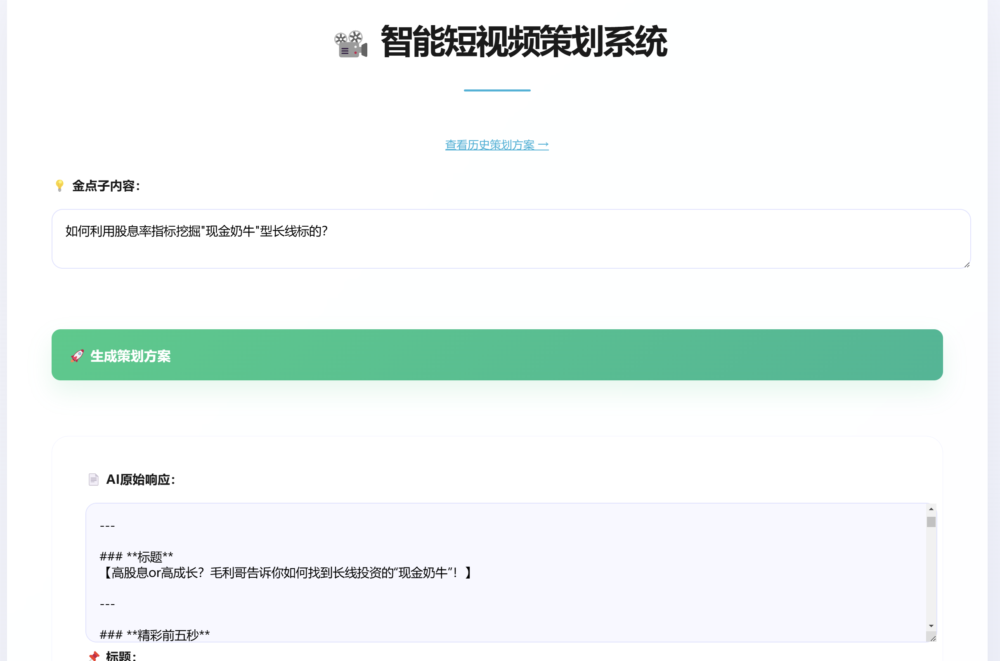
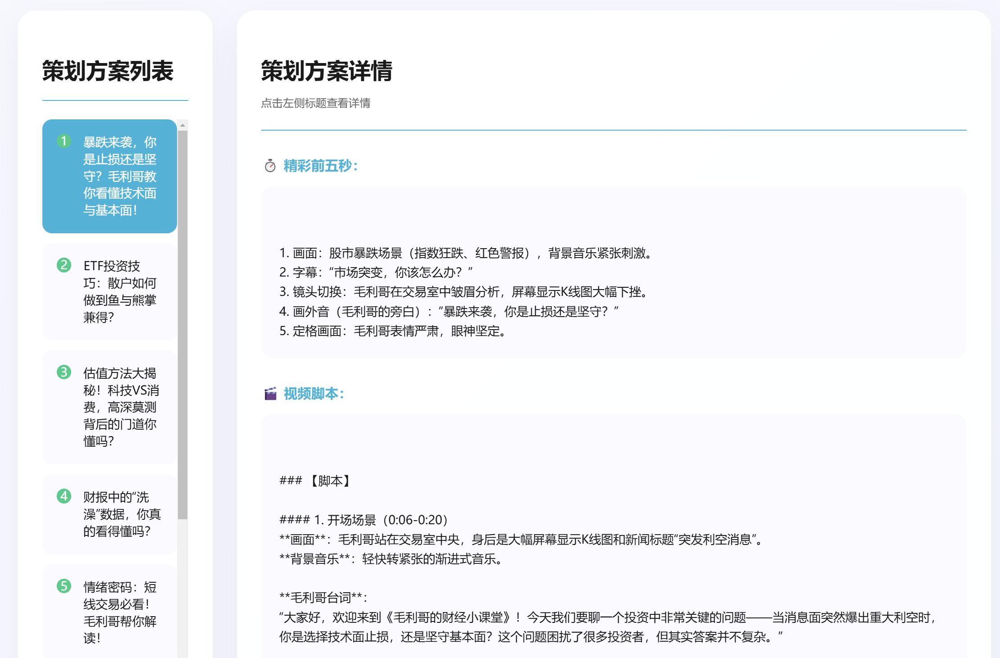

# 智能短视频策划系统 - AI Video Script Generator

[](https://www.python.org/)
[](https://flask.palletsprojects.com/)
[](LICENSE)

一个基于ollama DeepSeek-R1的AI的智能短视频脚本生成系统，集成内容创作、结构化存储与方案浏览功能，助力高效视频内容生产。




## 🌟 核心功能

- **智能生成**：集成DeepSeek大模型，自动生成标题/脚本/分镜
- **结构化存储**：MySQL数据库持久化保存方案
- **可视化浏览**：双栏式历史方案检视界面
- **交互设计**：动态加载提示与实时反馈
- **可扩展架构**：模块化设计便于功能扩展

## 🛠️ 技术栈

| 组件          | 技术选型                  |
|---------------|--------------------------|
| 后端框架      | Python Flask             |
| AI集成        | Ollama + DeepSeek-r1:32b |
| 数据库        | MySQL 8.0+               |
| 前端          | HTML5/CSS3/ES6           |

## 🚀 快速开始

### 环境要求

- Python 3.11+
- MySQL 8.0+
- Ollama服务+DeepSeek R1 32B+（本地运行，强烈建议使用DeepSeek R1 32B以上版本）
  or
- OpenAI兼容方式的API方式调用（可自行在代码中修改）
  

### 安装步骤

1. **克隆仓库**
   ```bash
   git clone https://github.com/handsomejustin/ai-video-script-generator.git
   cd ai-video-script-generator
   ```

2. **安装依赖**
   ```bash
   pip install -r requirements.txt
   ```

3. **配置ollama**
   ```
   C:\Users\abc>ollama list
    NAME                              ID              SIZE      MODIFIED
    openthinker:32b                   b3f4e577e166    19 GB     11 days ago
    deepseek-r1:32b                   38056bbcbb2d    19 GB     5 weeks ago
   ```
确认你已正确安装了ollama，同时已pull了deepseek-r1:32b（显卡需要nVdia RTX4090 24G)
如尚未安装，可以使用命令:
  ```
  C:\Users\abc>ollama pull deepseek-r1:32b
  ```

4. **数据库配置**
   ```sql
   CREATE DATABASE cehua;
   USE cehua;
   
   CREATE TABLE todo_list (
     id INT AUTO_INCREMENT PRIMARY KEY,
     title VARCHAR(255) NOT NULL,
     opening TEXT NOT NULL,
     script TEXT NOT NULL,
     direction TEXT NOT NULL,
     dialogue TEXT NOT NULL,
     created_at TIMESTAMP DEFAULT CURRENT_TIMESTAMP
   );
   ```

5. **配置环境变量**  
   在app.py中修改：
   ```
   # 数据库配置
    db_config = {
        'host': 'localhost',
        'user': 'root',
        'password': 'yourpassword',
        'database': 'cehua',
        'port': 3306,
        'charset': 'utf8mb4'
    }
   ```

6. **启动服务**
   ```bash
   python app.py
   ```

7. **访问系统**  
   打开浏览器访问：`http://localhost:5000`

## 🖥️ 使用指南

### 内容生成流程
1. 在首页输入需求描述和金点子
2. 点击「生成策划方案」获取AI原始响应
3. 逐个点击各字段的「提取」按钮结构化数据
4. 确认无误后保存到数据库

### 方案浏览模式
1. 访问 `/browse` 进入浏览界面
2. 左侧选择历史方案
3. 右侧查看完整细节
4. 支持分页导航（每页20条）

## ⚙️ 配置说明

### 模型参数调整
修改 `app.py` 中的prompt模板：
```python
# 示例生成模板
 prompt = f"""为毛利哥这个财经IP，策划财经方面的短视频《毛利哥的财经小课堂》，根据给的金点子内容，生成短视频所需要所有脚本。
要求为：
=========
【标题】：要求抓人眼球，看了就想点视频
【精彩前五秒】：前5秒如何抓人眼球？
【脚本】该视频的脚本、导演方式、演员台词。
=========
金点子为：{request.form['idea']}"""
"""
```

### 界面自定义
1. 修改 `static/style.css` 调整视觉样式
2. 编辑 `templates/` 下的HTML文件变更布局
3. 调整 `static/script.js` 实现交互逻辑

## 🤝 参与贡献

我们欢迎各种形式的贡献：
1. Fork项目并提交Pull Request
2. 提交Issue报告问题或建议
3. 完善文档或翻译
4. 测试并反馈使用体验

请遵循 [贡献指南](CONTRIBUTING.md) 进行操作。

## 📄 开源协议

本项目采用 [MIT License](LICENSE) 开源协议。
